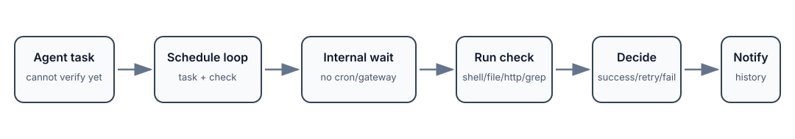

# vigil

> Self-scheduling follow-up MCP server for AI agents - checks later, retries with backoff, and notifies when work resolves.

**Tagline:** No cron. No gateway. No external scheduler.

[](https://opensource.org/licenses/MIT)


---

## 30-second demo

Input: an AI agent starts work that cannot be verified immediately.

vigil can:

1. schedule a follow-up check,
2. wait using its internal scheduler,
3. run the check later,
4. retry with backoff if it fails,
5. expire stale loops,
6. notify through file, webhook, chat, push, SMS, or email channels,
7. expose status through MCP tools and CLI.

Result: the agent does not need to remember to come back later.



## Before -> after

### Before

An agent says:

```text
I'll check later if the build finished.
```

But the session ends, context disappears, and nobody checks.

### After

vigil creates a durable loop:

```text
schedule -> wait -> check -> retry/backoff -> notify -> close
```

See [`examples/follow-up-loop/`](examples/follow-up-loop/) for a compact follow-up loop example.

## Who this is for

vigil is for people building AI agents, MCP workflows, local automation, deployment checks, build monitors, or operational loops where work needs to be checked after the current session has moved on.

It is especially useful when an agent triggers something asynchronous and needs a durable responsibility layer instead of a fragile reminder in chat history.

## What vigil is not

vigil is not a general-purpose task manager.

It is not meant to replace a full observability stack, queue system, or enterprise scheduler. It is a compact MCP-native follow-up layer: schedule a check, keep the loop alive, retry with backoff, record history, and notify when the state changes.

## What is vigil?

vigil is a standalone self-scheduling follow-up system for AI agents. No external scheduler, no gateway, no cron — it manages follow-up loops internally.

It closes a common agent gap: agents often start work whose result cannot be known immediately. vigil turns that future responsibility into a concrete loop with timing, checks, retries, expiry, history, and notifications.

## Why it matters

AI agents are often good at starting work but weak at returning later. Builds finish, deployments settle, files appear, services become healthy, and async operations complete after the original session context has moved on.

vigil makes those follow-ups durable. It:

- schedules checks for later,
- runs them through an internal polling loop,
- retries failed checks with configurable backoff,
- expires stale loops,
- writes notification history,
- supports multiple notification destinations,
- provides both MCP tools and a CLI for inspection.

## How it works

```text
Agent task / async operation
        |
        v
  SCHEDULE
  Store task, check type, command, timing, retry policy, and context
        |
        v
  WAIT
  Internal scheduler polls for loops that are due
        |
        v
  CHECK
  Run shell, file_exists, http, or grep checks
        |
        v
  DECIDE
  Success closes the loop; failure retries with backoff; stale loops expire
        |
        v
  NOTIFY + HISTORY
  Record events and notify through configured channels
```

## MCP Tools (9)

| Tool | Description |
|------|-------------|
| `loop_schedule` | Schedule a follow-up check |
| `loop_check` | Manually trigger a check |
| `loop_list` | List loops by status |
| `loop_cancel` | Cancel an active loop |
| `loop_history` | View past loops with stats |
| `loop_schedule_template` | Use templates (10 types — see below) |
| `loop_dashboard` | Formatted overview |
| `loop_batch` | Batch ops (cancel expired, retry failed, etc.) |
| `loop_write_result` | Write result to any file |

## Check Types (4)

- `shell` — command exit code or output match
- `file_exists` — file appeared at path
- `http` — GET URL, check status/body (reads up to 16KB)
- `grep` — search file for pattern (`pattern::filepath`)

## Templates (10)

| Template | Check Type | Use Case |
|----------|-----------|----------|
| `install_check` | shell | Verify package installed |
| `build_check` | file_exists | Verify build artifact |
| `deploy_check` | http | Verify deployment live |
| `download_check` | file_exists | Verify file downloaded |
| `docker_health` | shell | Verify container healthy |
| `database_ready` | shell | Verify DB accepting connections |
| `process_running` | shell | Verify process is running |
| `port_listening` | shell | Verify port is listening |
| `systemd_service` | shell | Verify systemd service active |
| `dns_resolve` | shell | Verify DNS resolution |

## Notification destinations

vigil can record notifications to file and/or send them through external channels when configured:

- file JSONL
- generic webhook
- Slack
- Telegram
- Discord
- Microsoft Teams
- ntfy.sh
- Pushover
- Gotify
- Matrix
- Twilio SMS
- Google Chat
- email / SMTP
- stderr logging

## Configuration (env vars)

| Var | Default | Description |
|-----|---------|-------------|
| `GEN_LOOP_STORE_DIR` | `~/.gen-loop/loop-store` | Store location |
| `GEN_LOOP_POLL_INTERVAL` | `10` | Scheduler poll interval (seconds) |
| `GEN_LOOP_NOTIFY` | `file` | Default notification method (file, webhook, slack, telegram, discord, teams, ntfy, pushover, gotify, matrix, twilio_sms, google_chat, email, all) |
| `GEN_LOOP_WEBHOOK_URL` | _(empty)_ | Default webhook URL |
| `GEN_LOOP_SLACK_WEBHOOK_URL` | _(empty)_ | Default Slack Incoming Webhook URL |
| `GEN_LOOP_TELEGRAM_BOT_TOKEN` | _(empty)_ | Default Telegram Bot API token |
| `GEN_LOOP_TELEGRAM_CHAT_ID` | _(empty)_ | Default Telegram chat/group ID |
| `GEN_LOOP_DISCORD_WEBHOOK_URL` | _(empty)_ | Default Discord Incoming Webhook URL |
| `GEN_LOOP_TEAMS_WEBHOOK_URL` | _(empty)_ | Default Microsoft Teams Workflow Webhook URL |
| `GEN_LOOP_NTFY_SERVER` | `https://ntfy.sh` | Ntfy server URL (supports self-hosted) |
| `GEN_LOOP_NTFY_TOPIC` | _(empty)_ | Ntfy topic name for push notifications |
| `GEN_LOOP_PUSHOVER_USER_KEY` | _(empty)_ | Pushover user key |
| `GEN_LOOP_PUSHOVER_APP_TOKEN` | _(empty)_ | Pushover application API token |
| `GEN_LOOP_GOTIFY_SERVER_URL` | _(empty)_ | Gotify server URL (e.g., https://gotify.example.com) |
| `GEN_LOOP_GOTIFY_APP_TOKEN` | _(empty)_ | Gotify application token |
| `GEN_LOOP_MATRIX_HOMESERVER` | _(empty)_ | Matrix homeserver URL (e.g., https://matrix.example.com) |
| `GEN_LOOP_MATRIX_ACCESS_TOKEN` | _(empty)_ | Matrix access token (Bearer auth) |
| `GEN_LOOP_MATRIX_ROOM_ID` | _(empty)_ | Matrix room ID (e.g., !abc:matrix.example.com) |
| `GEN_LOOP_TWILIO_ACCOUNT_SID` | _(empty)_ | Twilio Account SID |
| `GEN_LOOP_TWILIO_AUTH_TOKEN` | _(empty)_ | Twilio Auth Token |
| `GEN_LOOP_TWILIO_FROM_NUMBER` | _(empty)_ | Twilio phone number (E.164 format, e.g., +12125551234) |
| `GEN_LOOP_TWILIO_TO_NUMBER` | _(empty)_ | Recipient phone number (E.164 format) |
| `GEN_LOOP_GOOGLE_CHAT_WEBHOOK_URL` | _(empty)_ | Google Chat Incoming Webhook URL |
| `GEN_LOOP_SMTP_SERVER` | _(empty)_ | SMTP server hostname (e.g., smtp.gmail.com) |
| `GEN_LOOP_SMTP_PORT` | `587` | SMTP port (587 for STARTTLS) |
| `GEN_LOOP_SMTP_USERNAME` | _(empty)_ | SMTP authentication username |
| `GEN_LOOP_SMTP_PASSWORD` | _(empty)_ | SMTP authentication password |
| `GEN_LOOP_SMTP_FROM` | _(empty)_ | Sender email address |
| `GEN_LOOP_SMTP_TO` | _(empty)_ | Recipient email address(es), comma-separated |
| `GEN_LOOP_SMTP_USE_TLS` | `true` | Use STARTTLS encryption |
| `GEN_LOOP_MAX_CONCURRENT` | `5` | Max concurrent check threads |

## CLI

Inspect and manage the loop store from the command line - no MCP client needed.

```bash
gen-loop-cli list                      # List all loops
gen-loop-cli list --status active      # Filter by status
gen-loop-cli list --json               # JSON output
gen-loop-cli show loop-001             # Show loop details
gen-loop-cli dashboard                 # Overview of active + recent
gen-loop-cli history --limit 10        # Recent history entries
gen-loop-cli stats --json              # Aggregate statistics
gen-loop-cli cancel loop-001 --yes     # Cancel a loop
gen-loop-cli batch summary             # Status summary
gen-loop-cli batch cancel_expired      # Batch cancel expired loops
gen-loop-cli notifications             # Query notification history
gen-loop-cli notifications --loop-id loop-001 --event completed --limit 20
gen-loop-cli notifications --include-rotated --json
```

## Quick Start

```bash
# Install from a local checkout
cd vigil
uv pip install -e ".[dev]"

# Run tests
pytest tests/ -v

# Run as an MCP server
python -m gen_loop.server

# Use via mcporter
mcporter call gen-loop.loop_schedule task="Check build" check_command="ls dist/" check_after_minutes=2
mcporter call gen-loop.loop_dashboard
mcporter call gen-loop.loop_list

# Use CLI directly
gen-loop-cli list
gen-loop-cli dashboard
```

## Example

See [`examples/follow-up-loop/`](examples/follow-up-loop/) for a compact example showing a loop request, notification event, and written result.

## Showcase

See the [vigil showcase site](https://fbratten.github.io/vigil-showcase/) for demos and documentation.

## Version

0.15.0 — durable follow-up loops, internal scheduler, 9 MCP tools, 4 check types, 10 templates, multi-channel notifications, CLI inspection, and 148 tests.

## License

MIT
